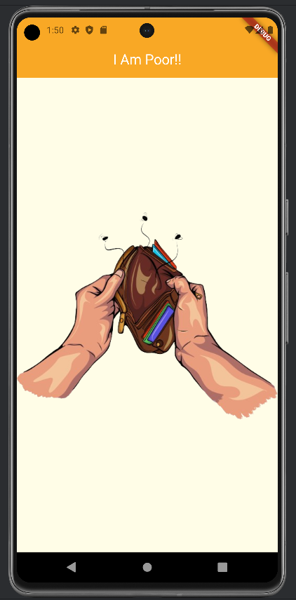

# i_am_poor
## Developer: Self Proclaimed Artist 
### Team: AB Sai RaM.

This project is an app that has no functionality other than show that you are poor.
On opening the app it will display a clipart image of an empty valet. 

This app was built to understand and practice the very basics of Flutter, Dart, MaterialApp and scaffold widget.
This also helps understand how to change and manipulate other basic widgets like color, center, etc.
#### Screenshots:
